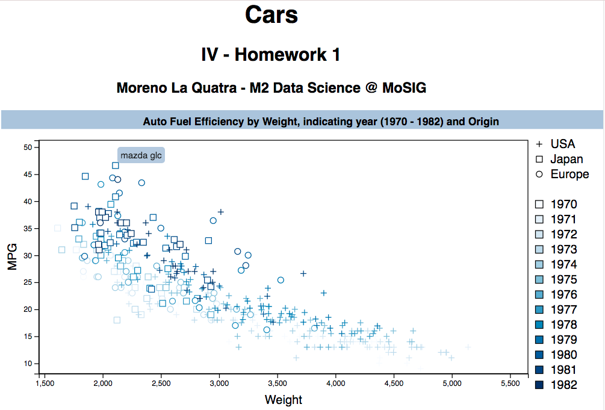

Cars dataset visualization
==================

A dataset of about 400 cars with 8 characteristics such as horsepower, acceleration, etc.

Files
-----

- data/cars.tsv   data set
- viz/cars.html   "visualisation" generated using d3.js

References
-----
- d3.js: http://d3js.org

Information Visualization Course (Grenoble INP - MoSIG)
-----

- Homework 1 of Information Visualization course.
- Creator: *Moreno La Quatra*
- Initial Template: provided by the teacher

Screenshot of the project
-----
  
